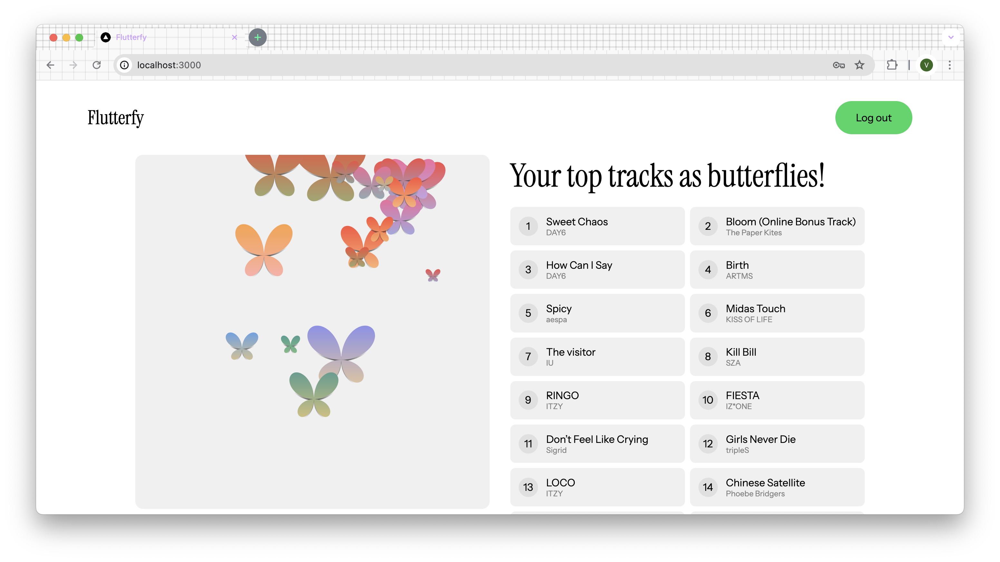
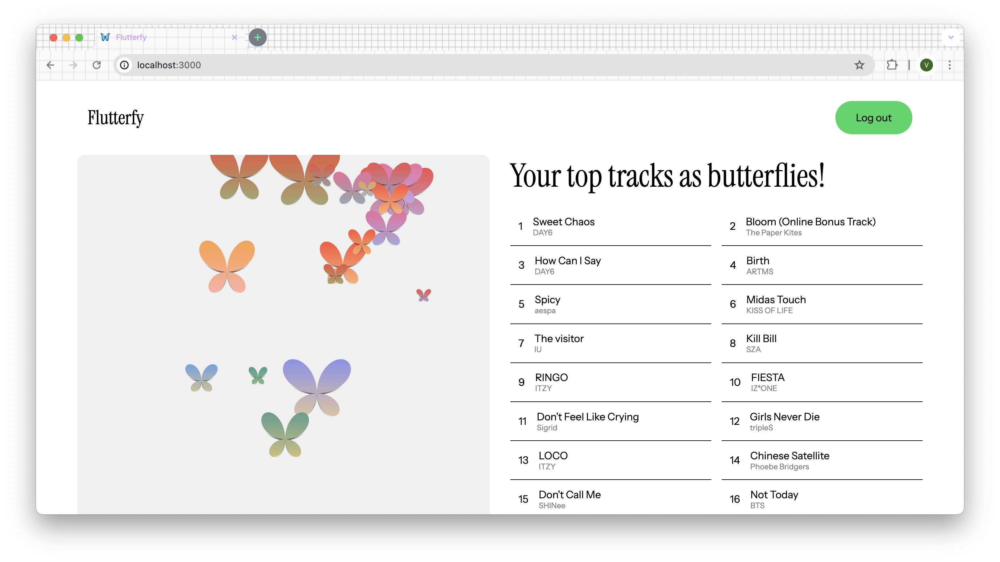

# Process

hello! i wasn't planning on writing a full process doc that walks through ideation, how i went about troubleshooting certain problems, what i've learnt, etc., mainly because it's been so long since i started this that i don't think i'll be able to write good notes that actually reflect my thought process at the time. i do have a few comments scattered around with resources i referred to when i really needed help, so hopefully those are still useful. i'll link the files with more interesting comments here:

- [integrating p5.js into next.js](components/SketchContainer/SketchContainer.js)
- [animating accordion items](components/AccordionItem/AccordionItem.js)

i thought it would still be nice, though, to have something to document my thoughts on building this website - hence this quick, informal doc :)

## Personal requirements

as mentioned in one of the accordion items, the idea for this website came about because i thought a website with a portmanteau of "spotify" and "butterfly" would be cute. i'd also been looking at data art / visualisation pieces (which i also find very cool!) recently, so i thought visualising spotify top tracks as butterflies would be a nice way to put the two together.

i set myself some constraints to challenge myself:

- **avoid depending on third-party packages as far as possible.** this is why i did not use a ui library + in particular, wrote the accordion item animation myself in pure javascript. (stumbling upon the answer to my problems on stackoverflow made me realise how little i knew about the native browser apis available! there are [so many](https://developer.mozilla.org/en-US/docs/Web/API)! exciting...) the only packages i use are next.js, p5.js, react, and react-dom (p5.js _is_ a wrapper over the native canvas api, but i'd set out to learn it anyway because i thought it was really cool, so it'd been part of the plan from the very beginning). i set this constraint in order to force myself to brush up on my fundamentals and make sure i knew how to implement something myself before outsourcing it to another library. also, i'd started learning web dev because i'd been introduced to the idea that websites are a way of expressing yourself, so relying on ui libraries felt like taking too much away from the creative process.
- relatedly, i wanted to **test my design skills** - being able to select good colours, being able to ensure a good sense of balance + hierarchy, etc. e.g. colour-wise, i knew i wanted to use spotify green so i based my colour choices around that green. i also spent some time fiddling with how to present the tracks so that they stood out enough. you can compare the original and final designs for the tracks below:

in the first version, i fell back onto my habit of putting things in rounded rectangles, but felt that the tracks looked too similar to the butterfly visualisation on the left, and were too "blocky" together, making the page look very rigid. i ended up switching to the design on the right, which looked a little cleaner with more variety + offered more white space for the eye to rest on.

- **make the website responsive.** ok, this wasn't really an explicit constraint i set myself, more something i just felt was important from the very beginning (of learning to make websites even; you can see this in some of my earlier websites like [copydf](https://valerietanhx.github.io/copydf/), [homework-2-valerietanhx](https://homework-2-valerietanhx.vercel.app/), and [lovesongs](https://github.com/valerietanhx/lovesongs), though the attempts are admittedly less technically challenging and less thorough). responsiveness turned out to be a huge pain to figure out, though, because of the ascii art i used... so the code i have for responsiveness is not great :( i am a little frustrated at how the ratio of the elements isn't preserved neatly (see [areas for improvement](#areas-for-improvement)), but am satisfied enough with the fact that things will work + look decent (no random overlaps between elements, nothing monopolising the screen, etc.) in all screen sizes i tried, from 320px up to 2560px.

## Things I learnt

this starts out as a list of the packages i used, LOL. but there's more, i promise :)

- i got much better at **react**! some specific react things i got a better hang of:
  - useEffect (though turns out i didn't use it in the best way, see [areas for improvement](#areas-for-improvement) - but at least i'm more sure of what it does!)
  - useRef turned out to be really useful for integrating the canvas and its related components (e.g. the download buttons) with the rest of the page, e.g. getting the size of the canvas' parent div to serve as its init size
  - the concept of children components... i knew i could pass props in but hadn't really considered / seen the use of passing whole other components as props! it turned out to be useful with my Header component.
- **next.js**, ofc, since that's the framework i used. honestly, i chose to use next.js only because at the time it was the only (full-stack) react framework i knew of. i was really confused about client/server components, and only realised accidentally some time in february or march that having page.js be a client component was not generally considered best practice, and refactored my code
- **p5.js** for creating graphics! i think this was the hardest thing to pick up because there was relatively little documentation on doing more complex things with it, scattered about random youtube videos.
  - in particular, it was a struggle getting each butterfly to have a unique gradient, which required the use of push() and pop().
  - making the canvas responsive was also tough! the solutions i found online resized the canvas but not the elements in the canvas (i.e. in my case, the butterflies would go beyond the canvas border and out of sight if the screen was smaller). i used their solution as a foundation, then fiddled around myself to figure out how to make the butterflies responsive as well.
- i adored working with **css modules**! somehow this time smth clicked and now i understnad how to work with them + appreciate them as a clean way to organise css :D
- the **oauth2** authorisation code flow! took me ages to figure out how to check for access token expiry and use a refresh token... :p

## Areas for improvement

some things i think could be improved, beyond product enhancements / adding features (see my [issues](https://github.com/valerietanhx/flutterfy/issues)):

- **responsiveness s.t. proportions are preserved.** i think in general i'd like to learn more about how to implement responsiveness well, e.g. should i just use more media queries? or is the way i attempted to do it here better (mainly using vw, max, and min)?
- the **design system** could've been set up better! e.g. having set values for border-radius, font-size, etc. throughout. i am happy with how the colours are set as css variables but everything else is just hardcoded in each css module file, which isn't great for maintenance.
- **make better use of client/server components!** in particular, the Butterflies component could be written as a server component since the only interactivity (that necessitates it being a client component) really only comes from the buttons + accordion, but it's a client component because i converted api calls into a hook that relies on useState + useEffect. turns out using an effect [isn't the best way to fetch data](https://react.dev/learn/you-might-not-need-an-effect)... i also suspect that if i were to extend the project s.t. users can pick between short-term, medium-term and long-term top tracks, having the Butterflies component be a client component might cause issues with rerendering, though i haven't confirmed this yet.
